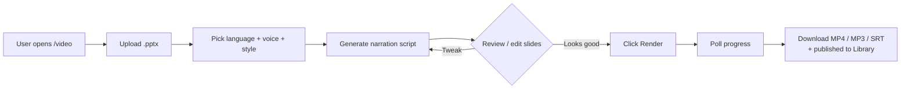
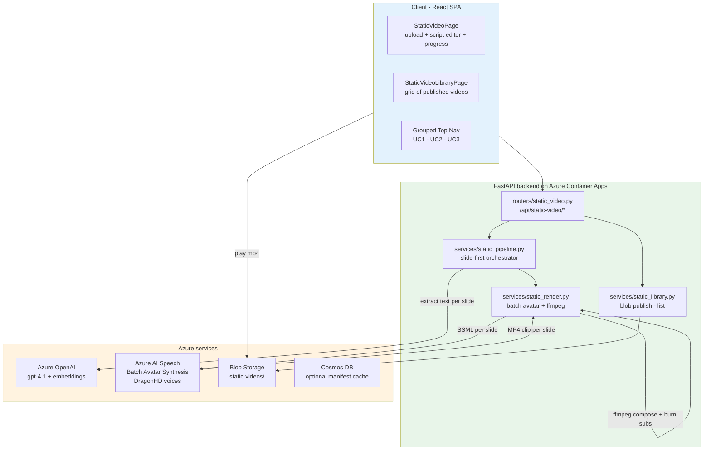
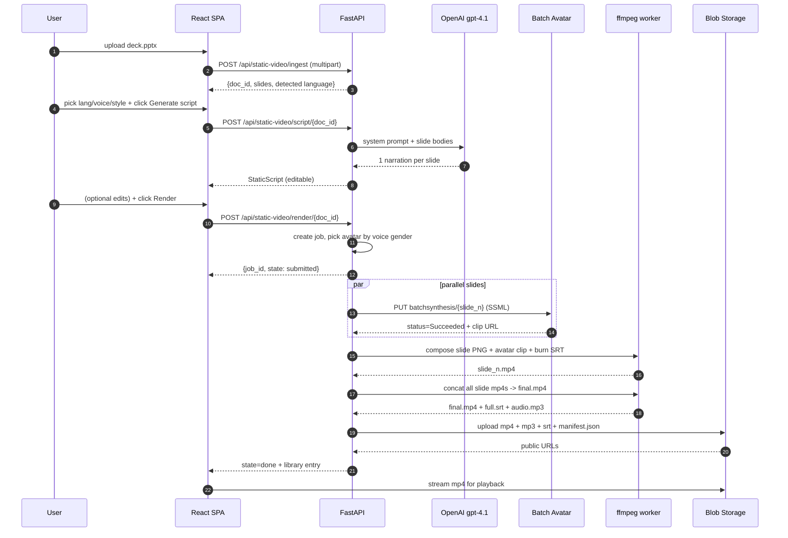
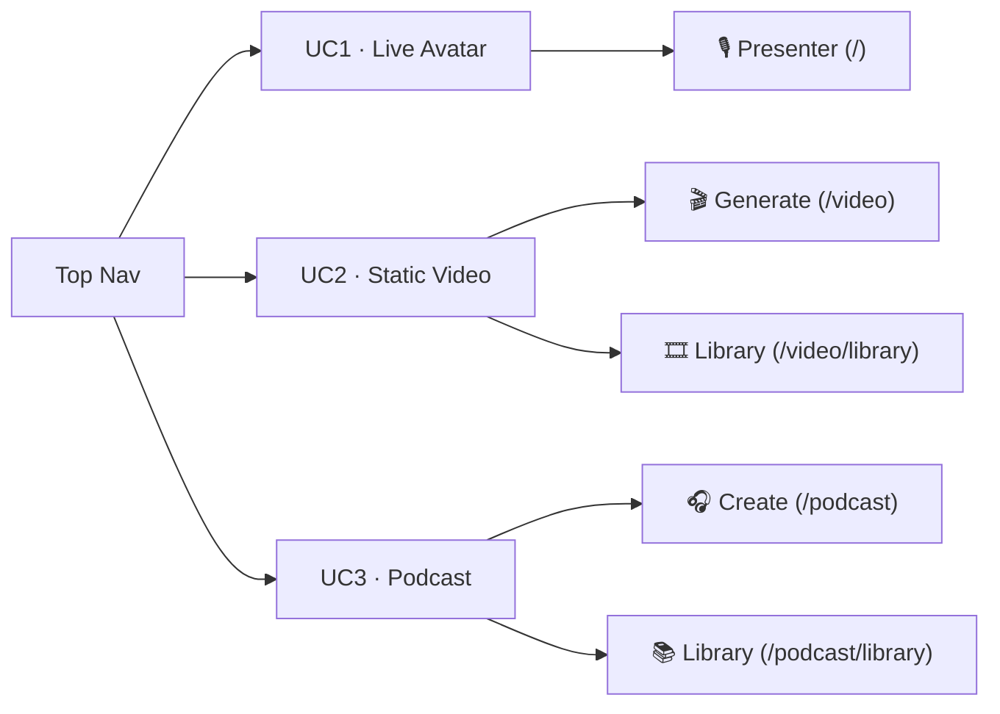
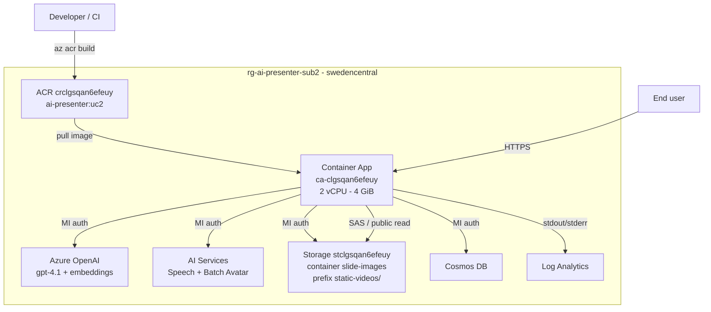

# UC2 — Automated Static Video Generation

**Status:** Shipped · `master` · deployed to `rg-ai-presenter-sub2` (swedencentral)
**RFI reference:** Saint-Gobain RFI — AI Avatar Solution, Use Case 2
**Branch history:** `feat/uc2-static-video` → merged `a8ba703`

---

## 1. Purpose

Turn a `.pptx` into a narrated, lip-synced **MP4 video** automatically — pick a voice, pick a language, pick an avatar. No live presenter needed. The output is stored in a public library so anyone with the link can watch (or re-download MP3 / SRT).

This complements:

- **UC1** — *live* avatar (WebRTC, presenter-driven)
- **UC3** — podcast-style dual-avatar from any document

---

## 2. User Flow



Every generated video lands in the **Library** (`/video/library`) — a grid of thumbnails per language/title.

---

## 3. End-to-End Architecture



### Why "slide-first"?

Earlier UC1 used **one batch job per presentation** — a monolithic avatar video. UC2 flips this: **one batch job per slide**, then ffmpeg stitches clips on top of the slide image with the avatar as a picture-in-picture. Benefits:

- Each slide is visible full-screen; avatar only needs a corner
- Errors in one slide don't poison the whole deck (retry a single clip)
- Parallelism: N slides = N batch jobs running in parallel on Azure Speech
- Subtitles burn-in timed per slide (fine-grained)

---

## 4. Pipeline Stages



### Stage map (what you see in the progress bar)

| State | Stage | Percent | What's happening |
|---|---|---|---|
| `submitted` | queued | 0 | Job accepted, awaiting start |
| `rendering` | submitting | 5 | Creating batch-avatar jobs |
| `rendering` | synthesizing | 5–75 | N/M slides done by Batch Avatar |
| `composing` | compositing | 75–90 | ffmpeg: slide + avatar PiP + subtitles |
| `publishing` | uploading | 90–98 | Push mp4/mp3/srt to Blob |
| `done` | done | 100 | Manifest written, entry in library |

---

## 5. Voice → Avatar matching

The major UX fix from this cycle. Default `DEFAULT_AVATAR = "lisa"` is **female**; default voices (`Andrew`, `Rémy`, `Tristan`, `Florian`) are all **male** → mismatch.

Fix in `demos/backend/services/static_render.py`:

```python
_MALE_VOICE_NAMES   = {"andrew", "remy", "tristan", "florian", ...}
_FEMALE_VOICE_NAMES = {"ava", "vivienne", "ximena", "seraphina", ...}

def avatar_for_voice(voice: str, fallback: str = DEFAULT_AVATAR) -> str:
    name = voice.split("-")[-1].split(":")[0].lower()
    if name in _MALE_VOICE_NAMES:   return "harry"   # business style
    if name in _FEMALE_VOICE_NAMES: return "lisa"    # casual-sitting
    return fallback
```

Called from `_submit_slide` before `AVATAR_MAP.get(...)` — overrides any caller-provided avatar that doesn't match the picked voice.

---

## 6. Frontend navigation

Pill-grouped top nav, clarifies which use case each tab belongs to:



Every link has a `title` tooltip explaining what the segment does. Each group has its own pill container with a small muted `UC# · Name` label.

---

## 7. API Surface

All under `/api/static-video` (prefix from `routers/static_video.py`).

| Method | Path | Purpose |
|---|---|---|
| `GET`  | `/languages` | supported target languages |
| `GET`  | `/voices` | 16 DragonHD voices w/ gender + style hints |
| `POST` | `/ingest` | multipart upload, returns `doc_id` + parsed slides |
| `POST` | `/script/{doc_id}` | LLM → narrations per slide |
| `GET`  | `/script/{doc_id}` | fetch current narrations |
| `POST` | `/render/{doc_id}` | start render job |
| `GET`  | `/jobs/{job_id}` | poll state + percent + per-stage message |
| `GET`  | `/jobs/{job_id}/file/{kind}` | stream `mp4` / `mp3` / `srt` / `thumb` |
| `GET`  | `/library` | list published videos |
| `GET`  | `/library/{job_id}` | full manifest of one entry |
| `DELETE` | `/library/{job_id}` | remove from library |

---

## 8. Deployment topology



### Build & deploy (manual path used)

```powershell
# 1. Build in ACR (no local docker needed)
az acr build -r crclgsqan6efeuy -t ai-presenter:uc2 -t ai-presenter:latest --no-logs .

# 2. Roll new revision with bumped resources
az containerapp update `
  -n ca-clgsqan6efeuy -g rg-ai-presenter-sub2 `
  --image crclgsqan6efeuy.azurecr.io/ai-presenter:uc2 `
  --cpu 2.0 --memory 4.0Gi `
  --revision-suffix uc2-v1
```

### Why 2 vCPU / 4 GiB?

4 parallel slide renders + ffmpeg compose easily blow past 2 GiB — container OOM-kill wipes the in-memory `JOBS` dict and jobs surface as 404. Bumping fixed it for the 4-lang e2e.

### MCAPS storage gotcha

Fresh storage accounts in MCAPS subs default to `publicNetworkAccess=Disabled`. Even with the right RBAC (`Storage Blob Data Contributor` for the ACA managed identity), blob uploads fail with `AuthorizationFailure` until you:

```powershell
az tag update --resource-id <storage-id> --operation merge `
  --tags SecurityControl=ignore CostControl=ignore

az storage account update -n <name> -g <rg> `
  --public-network-access Enabled --default-action Allow
```

Symptom when this is wrong: job goes `state=done` but `archive_state=failed` and `library` returns `[]`.

---

## 9. Testing

Two scripts ship with the repo:

| Script | What it does |
|---|---|
| `scripts/make_test_pptx.py` | Generates a 3-slide test deck (`output/uc2-test-deck.pptx`) — title + body + speaker notes |
| `scripts/uc2_multilang_run.py` | Runs the full pipeline (ingest → script → render) in 4 languages **in parallel** against `$env:UC2_API` |

```powershell
$env:UC2_API = "https://ca-clgsqan6efeuy.thankfulhill-3503b062.swedencentral.azurecontainerapps.io"
python scripts/uc2_multilang_run.py
```

Expected output: 4 jobs done, 4 library entries, ~8 min total wall-clock.

---

## 10. Known limits (PoC only)

- **In-memory state** — `JOBS`, `SCRIPTS`, `DOCUMENTS` live in Python process memory. Container restart = lost in-flight work. Persisted-job work ends up in Blob regardless.
- **No job queue** — `BackgroundTasks` only. One replica = one workload. For prod, replace with Azure Queue + worker.
- **No auth** — public endpoints. Fine for demo-behind-a-link; for real use, front with AAD + per-tenant isolation.
- **No observability UI** — logs go to Log Analytics; no dashboard. Use KQL directly for now.
- **Library is flat** — no tagging, no folders, no search. Add later if demand.

---

## 11. Files touched in this use case

| File | Why |
|---|---|
| `demos/frontend/src/pages/StaticVideoPage.tsx` | Upload + script editor + progress UI |
| `demos/frontend/src/pages/StaticVideoLibraryPage.tsx` | Grid of published videos |
| `demos/frontend/src/components/TopNav.tsx` | Grouped nav UC1/UC2/UC3 + tooltips |
| `demos/frontend/src/services/staticVideoApi.ts` | Typed client for `/api/static-video/*` |
| `demos/backend/routers/static_video.py` | FastAPI routes + in-memory stores |
| `demos/backend/services/static_models.py` | Pydantic models |
| `demos/backend/services/static_pipeline.py` | Slide-first orchestration |
| `demos/backend/services/static_render.py` | Batch avatar + ffmpeg + voice→avatar matching |
| `demos/backend/services/static_library.py` | Blob publish + list + delete |
| `scripts/make_test_pptx.py` | Test deck generator |
| `scripts/uc2_multilang_run.py` | E2E multilang driver (reads `$UC2_API`) |

---

## 12. Related docs

- [Architecture overview](architecture.md) — UC1 + system-wide
- [UC3 podcast design](uc3-podcast-design.md)
- [Deep dive: Azure deployment](deep-dive-azure.md)
- [Docs index](index.md)
